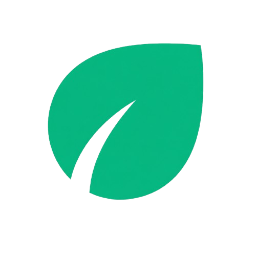
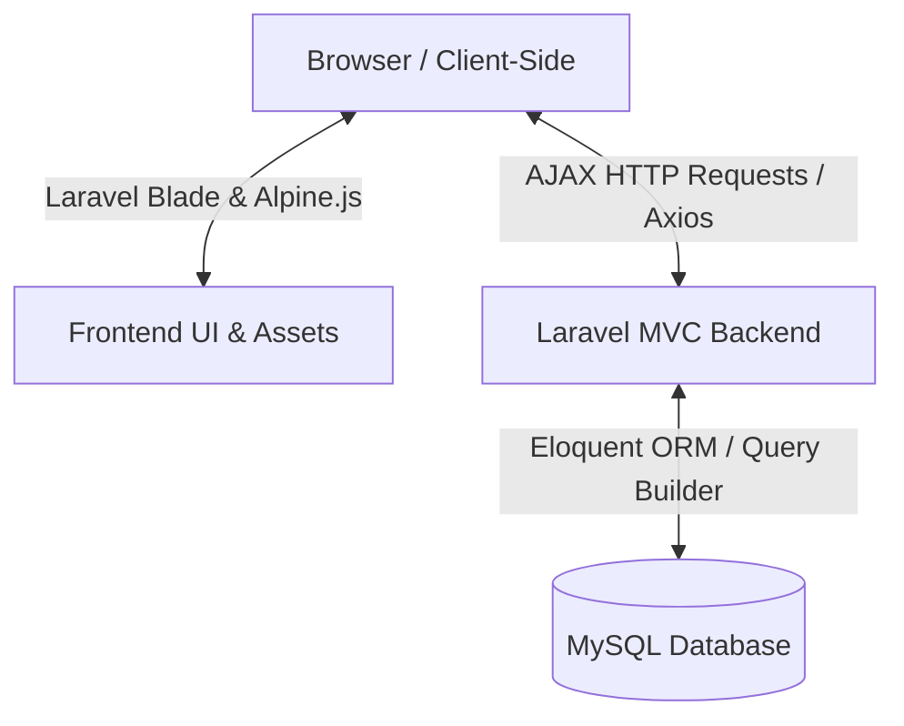

<p align="center">
  
</p>

<h1 align="center">EcoTrash</h1>

<p align="center">
  <strong>Sistem Pengelolaan Sampah Berbasis Komplek</strong>
</p>
<p align="center">
EcoTrash adalah aplikasi web pengelolaan sampah terintegrasi untuk lingkup komplek perumahan. Aplikasi ini memfasilitasi warga dalam melakukan pemesanan jadwal pengangkutan sampah secara teratur, melaporkan tumpukan sampah liar menggunakan peta interaktif, serta mendukung penugasan operasional petugas lapangan dan pengawasan berbasis data oleh administrator.
</p>

---

## Tentang Project

EcoTrash dibuat untuk mengatasi permasalahan penumpukan sampah liar dan tidak teraturnya jadwal penjemputan sampah rumah tangga di area pemukiman komplek perumahan. Koordinasi pengelolaan sampah di tingkat komplek sering kali berjalan lambat akibat keterbatasan pelacakan status penjemputan, kurangnya visibilitas data titik penumpukan sampah liar, serta komunikasi yang tidak terintegrasi. 

EcoTrash hadir sebagai solusi untuk mempermudah warga dalam menjadwalkan penjemputan sampah rumah tangga, sekaligus berperan aktif melaporkan timbunan sampah liar di sekitar komplek melalui peta koordinat interaktif. Melalui sistem penghargaan (gamifikasi) berbasis koin, EcoTrash berupaya memotivasi partisipasi aktif warga secara kolaboratif guna menjaga kebersihan dan kesehatan lingkungan komplek.

---

## Fitur Utama

Sistem EcoTrash membagi fungsionalitas aplikasi berdasarkan tiga peran pengguna utama:

### Warga
* **Pemesanan Pengangkutan**: Melakukan pemesanan jadwal angkut sampah rumah tangga sesuai pilihan alamat profil dan kategori ukuran sampah.
* **Pelaporan Sampah Liar**: Melaporkan titik koordinat timbunan sampah liar di peta lengkap dengan unggahan foto bukti dan deskripsi laporan.
* **Edukasi**: Membaca artikel informatif seputar pengelolaan limbah lingkungan dan menyimpannya ke daftar bookmark personal.
* **Coin**: Mendapatkan koin dari penyelesaian pengangkutan sampah atau persetujuan laporan sampah liar, yang dapat digunakan sebagai potongan tagihan pengangkutan (maksimal 50%).
* **Aktivitas**: Memantau rekam jejak linimasa status pesanan pengangkutan dan laporan sampah liar secara berkala.
* **Notifikasi**: Menerima pembaruan informasi secara instan terkait status pesanan maupun laporan sampah liar.

### Petugas
* **Kelola Tugas**: Memantau daftar rincian tugas operasional penjemputan sampah harian di area komplek tugasnya.
* **Update Status**: Memperbarui status pengerjaan tugas secara realtime (menunggu, diproses, selesai, gagal).
* **Upload Bukti**: Mengunggah foto dokumentasi bukti penyelesaian penjemputan sampah di lokasi warga.
* **Tindak Lanjut Laporan**: Melakukan pembersihan sampah liar berdasarkan penugasan admin, serta memperbarui status tindak lanjut (mulai, tunda, selesai).

### Admin
* **Dashboard**: Memantau data agregasi statistik total koin beredar harian, fluktuasi pesanan baru, dan ringkasan aktivitas sistem.
* **Monitoring Operasional**: Memantau riwayat pelaksanaan tugas pengangkutan di lapangan dan menetapkan/mengalihkan penugasan Petugas.
* **Verifikasi Laporan**: Menyetujui atau menolak laporan sampah liar warga, serta menggabungkan (merge) tiket laporan yang terindikasi ganda/duplikat.
* **Manajemen Pengguna**: Mengelola data akun Warga komplek serta melakukan registrasi akun Petugas lapangan baru.
* **Manajemen Edukasi**: Mengelola konten artikel edukasi lingkungan (CRUD) melalui editor HTML terintegrasi.

---

## Tech Stack

<table>
  <thead>
    <tr>
      <th align="center">💻 Frontend</th>
      <th align="center">⚙️ Backend</th>
      <th align="center">🗄️ Database</th>
      <th align="center">🔧 Tools</th>
    </tr>
  </thead>
  <tbody>
    <tr>
      <td valign="top" align="center">
        <br/><br/>
        <br/><br/>
        <br/><br/>
        <br/><br/>
        
      </td>
      <td valign="top" align="center">
        
      </td>
      <td valign="top" align="center">
        
      </td>
      <td valign="top" align="center">
        <br/><br/>
        
      </td>
    </tr>
  </tbody>
</table>

---

## Arsitektur Sistem

Berikut adalah diagram alur arsitektur sederhana aplikasi web monolitik EcoTrash:



---

## Cara Menjalankan Project

Ikuti langkah-langkah di bawah ini untuk memasang dan menjalankan aplikasi EcoTrash di lingkungan lokal:

1. **Kloning Repositori**
   ```bash
   git clone <url-repository-github>
   cd EcoTrash
   ```

2. **Instalasi Dependensi PHP & JavaScript**
   ```bash
   composer install
   npm install
   ```

3. **Konfigurasi Berkas Environment**<br>
   Salin berkas `.env.example` menjadi `.env` dan sesuaikan pengaturan koneksi database MySQL Anda:
   ```bash
   cp .env.example .env
   # Di Windows PowerShell: copy .env.example .env
   ```

4. **Generate Application Key**
   ```bash
   php artisan key:generate
   ```

5. **Jalankan Migrasi Database & Seeder**<br>
   Jalankan perintah berikut untuk menginisialisasi skema tabel lengkap beserta data dummy awal (akun Admin, Warga, Petugas, data komplek, dan artikel):
   ```bash
   php artisan migrate:fresh --seed
   ```

6. **Tautkan Public Storage**<br>
   Hubungkan folder penyimpanan lokal agar foto profil, foto laporan, dan bukti penjemputan dapat diakses secara publik di browser:
   ```bash
   php artisan storage:link
   ```

7. **Jalankan Server Lokal**<br>
   Jalankan server Laravel dan bundler aset secara bersamaan di terminal terpisah:
   ```bash
   # Terminal 1 (Laravel Server)
   php artisan serve

   # Terminal 2 (Vite Asset Bundler)
   npm run dev
   ```
   Aplikasi dapat diakses melalui browser pada alamat `http://127.0.0.1:8000`.

---

## Dokumentasi Fitur

Berikut adalah ringkasan alur proses kerja untuk dua fitur utama EcoTrash:

### Pemesanan Pengangkutan
1. **Pilih Alamat**: Warga menentukan lokasi penjemputan dari daftar alamat profilnya.
2. **Pilih Kategori**: Warga memilih ukuran sampah (Kecil, Sedang, Besar).
3. **Pilih Jadwal**: Warga memilih hari operasional pengangkutan yang tersedia.
4. **Gunakan Koin**: Warga dapat memilih opsi pemotongan biaya tagihan menggunakan saldo koin (maksimal 50%).
5. **Konfirmasi & Bayar**: Warga menyelesaikan simulasi pembayaran hingga status pesanan lunas (`paid`).
6. **Penjemputan**: Petugas lapangan yang bertugas di komplek terkait melakukan penjemputan sampah di lokasi warga.
7. **Status Selesai**: Petugas mengunggah foto bukti penjemputan dan mengubah status tugas menjadi selesai, yang otomatis menambahkan koin ke saldo warga.

### Pelaporan Sampah Liar
1. **Peta Koordinat**: Warga menentukan lokasi tumpukan sampah liar di peta Leaflet.js.
2. **Detail Laporan**: Warga mengunggah foto sampah liar dan mengisi rincian deskripsi laporan.
3. **Kirim**: Warga mengirimkan tiket laporan ke sistem.
4. **Verifikasi Admin**: Admin memeriksa validitas laporan (Setujui, Tolak, atau Merge Duplikat).
5. **Reward Koin**: Jika disetujui, pelapor pertama mendapat reward koin dan admin menugaskan petugas lapangan.
6. **Tindak Lanjut**: Petugas membersihkan tumpukan sampah liar di lokasi koordinat dan mengunggah foto bukti pembersihan setelah selesai.

---

## Tim Pengembang

Aplikasi EcoTrash dikembangkan oleh Tim PPL dengan susunan anggota sebagai berikut:

| Nama | github |
| ---- | ------ |
| Fikri Surya Prayoga | [fikrisuryaprr](https://github.com/fikrisuryaprr) |
| Adinda Ramadhani | [adindaramadani](https://github.com/adindaramadani) |
| Muhammad Fizry Alifta | [fizry-al](https://github.com/fizry-al) |
| Levi Soraya | [rrayyyaaaa](https://github.com/rrayyyaaaa) |
| Aulia Indah Nuriaji | [aulia0305](https://github.com/aulia0305) |
| Syafrie Rahman | [Syafrie12](https://github.com/Syafrie12) |
| Zhafran Ahmad Zaidan | [ZhafranAZ](https://github.com/ZhafranAZ) |

---

## Kontribusi

Repositori ini dikembangkan khusus untuk kebutuhan akademik dalam memenuhi mata kuliah Proyek Perangkat Lunak (PPL). Oleh karena itu, repositori ini bersifat tertutup (read-only) dan tidak menerima kontribusi publik atau pull request eksternal di luar anggota tim pengembang terdaftar.

---

## License

Project ini dibuat untuk keperluan akademik.
Copyright © 2026. All rights reserved.
