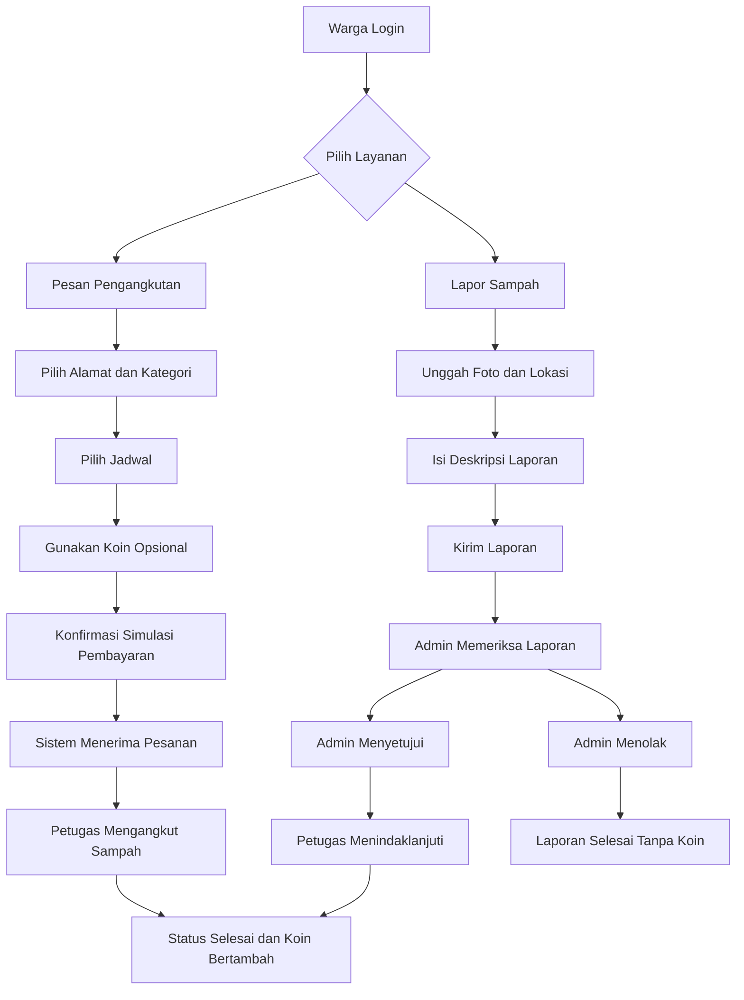
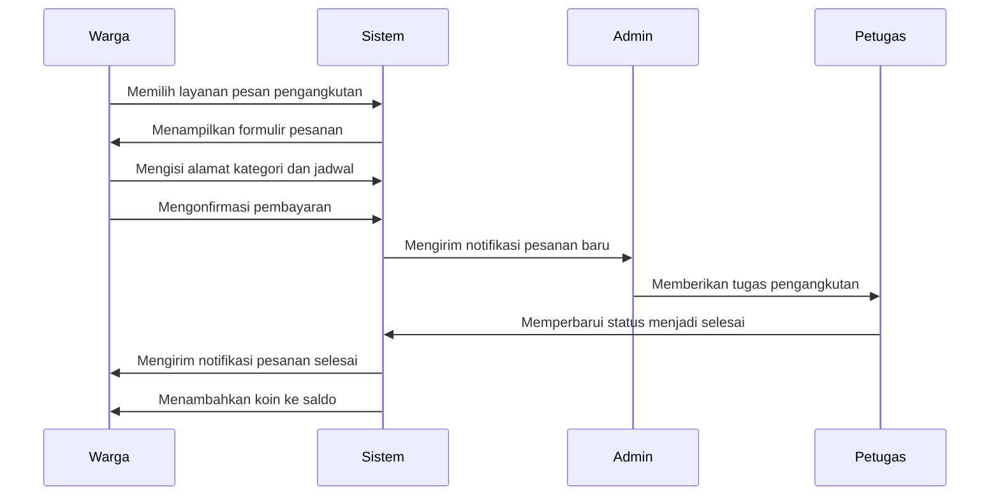
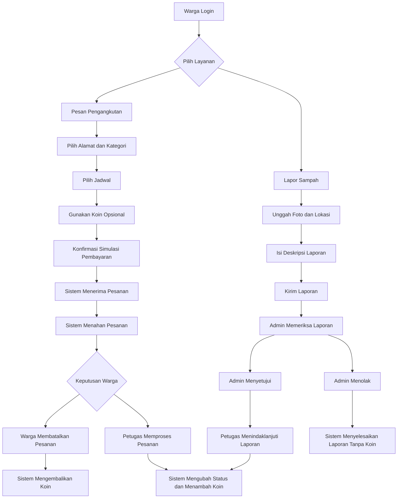
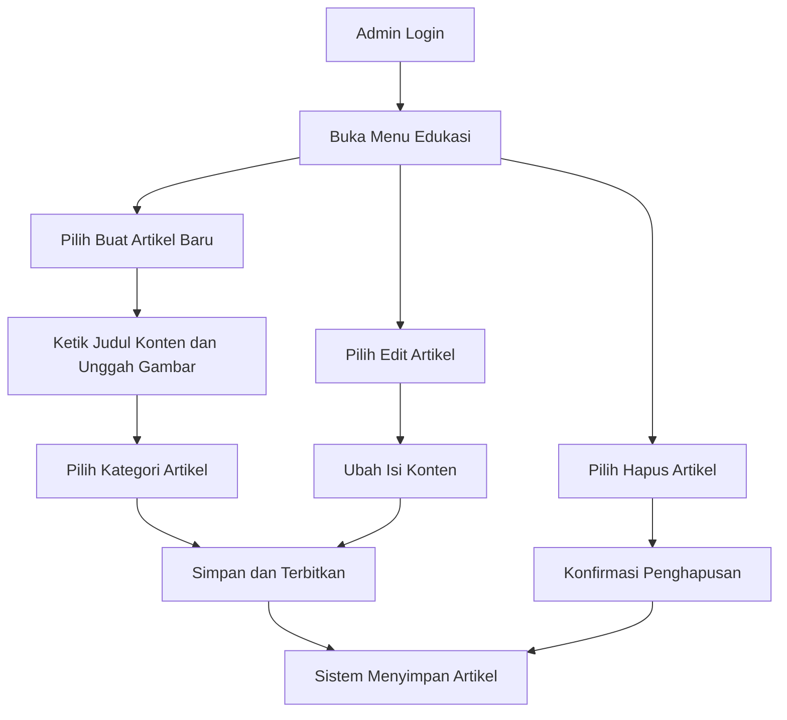
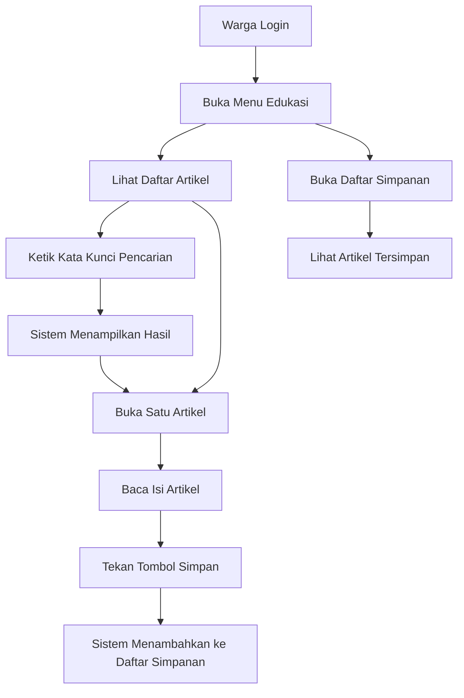
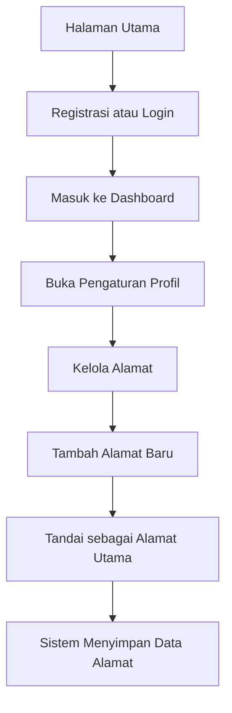
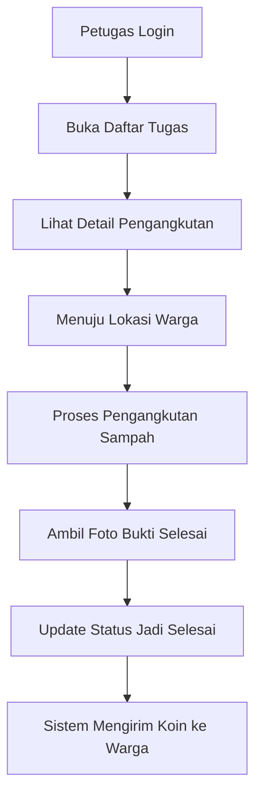
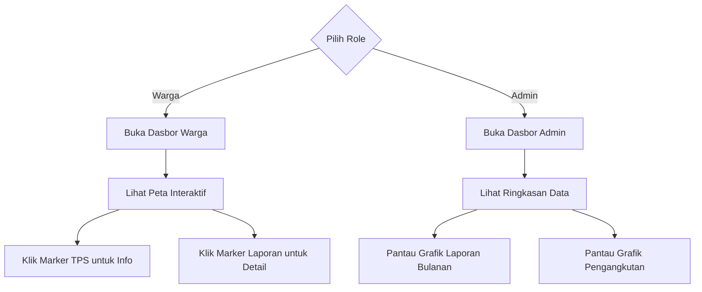

# 📄 PRODUCT REQUIREMENT DOCUMENT (PRD)

## EcoTrash — Sistem Pengelolaan Sampah Berbasis Komplek

***

## 1. 📌 Overview

EcoTrash adalah aplikasi web untuk pengelolaan sampah di lingkungan komplek/perumahan yang memungkinkan:

* Warga memesan pengangkutan sampah

* Warga melaporkan sampah liar

* Petugas mengelola pengangkutan

* Admin memonitor dan mengatur sistem

Sistem dilengkapi dengan:

* Dashboard berbasis data

* Peta interaktif

* Sistem coin (reward)

***

## 2. 🎯 Tujuan Produk

* Mempermudah pengangkutan sampah

* Mengurangi sampah liar

* Meningkatkan partisipasi warga

* Memberikan insight melalui dashboard

***

## 3. 👥 Role Pengguna

### 👤 User (Warga)

* Memesan pengangkutan sampah

* Melaporkan sampah

* Melihat dashboard

* Menggunakan coin

### 🛠️ Admin

* Mengelola user

* Verifikasi laporan

* Mengatur jadwal

* Assign petugas

* Monitoring dashboard

### 🚛 Petugas

* Melihat tugas

* Melakukan pengangkutan

* Update status

***

## 4. 🧩 Fitur Utama

***

### 4.1 Manajemen Profil

* Registrasi & login (semua role satu halaman)

* User dapat menyimpan alamat (default + tambahan)

* Admin dapat mengelola user & role

***

### 4.2 Pembuangan Sampah (Core Feature)

#### Flow:

1. User login
2. User memilih alamat (default / tersimpan)
3. User memilih kategori sampah:

   * Kecil

   * Sedang

   * Besar
4. User memilih jadwal (disediakan admin)
5. (Opsional) menambahkan catatan
6. User melakukan pembayaran (simulasi)
7. Petugas melakukan pengangkutan
8. Status berubah menjadi selesai

#### Detail:

* Alamat disimpan dan dapat digunakan kembali

* Jadwal dibuat oleh admin (slot harian)

* Status pesanan:

  * Menunggu

  * Diproses

  * Selesai

***

### 4.3 Pelaporan Sampah

#### Flow:

1. User membuat laporan
2. User mengisi:

   * Foto

   * Lokasi (map / pin)

   * Deskripsi
3. Admin memverifikasi laporan:

   * Approve / Reject
4. Jika approve:

   * Assign petugas
5. Petugas menindaklanjuti
6. Status diperbarui

***

### 4.4 Edukasi

* Admin dapat membuat, mengedit, dan menghapus artikel

* User dapat:

  * Membaca artikel

  * Mencari artikel

  * Bookmark artikel

***

### 4.5 Dashboard Informatif

#### Admin:

* Ringkasan data

* Grafik laporan

* Grafik pengangkutan

#### User:

* Peta lokasi TPS (marker)

* Peta titik laporan (klik marker untuk detail)

***

### 4.6 Sistem Coin

#### Mendapatkan Coin:

* Laporan disetujui

* Pengangkutan selesai

#### Penggunaan Coin:

* Digunakan untuk potongan biaya transaksi

#### Mekanisme:

* Coin otomatis masuk ke saldo user

* Digunakan pada transaksi berikutnya

***

### 4.7 Notifikasi

* Notifikasi pesanan

* Notifikasi laporan

* Notifikasi aktivitas sistem

***

## 5. ⚙️ Business Rules

* Pemesanan hanya dapat dilakukan pukul **00.00 – 13.00**

* Pengangkutan dilakukan sesuai jadwal admin (default 16.00)

* User wajib memilih kategori sampah

* Coin diberikan setelah:

  * Laporan disetujui

  * Pengangkutan selesai

* Sistem hanya digunakan dalam lingkungan **komplek/perumahan**

***

## 6. 🧱 Tech Stack

### 🌐 Frontend

* Next.js

* React.js

* Tailwind CSS

* Axios

* Leaflet.js + OpenStreetMap

***

### ⚙️ Backend

* Laravel (REST API)

* Laravel Sanctum (Authentication)

***

### 🗄️ Database

* MySQL

***

### 📊 Dashboard

* Chart.js / Recharts

***

### 🔄 Tools

* GitHub

* Jira

***

### ☁️ Deployment (Planned)

* Domain: `ecotrash.laravel.app`

* Deployment berbasis Laravel

***

## 7. 🧩 Arsitektur Sistem

Frontend (Next.js)
↓ (API Call - Axios)
Backend (Laravel API)
↓
Database (MySQL)

***

## 8. 📊 Non-Functional Requirements

* Responsive (mobile & desktop)

* User-friendly

* Fast response

* Stabil untuk skala kecil

* Data tersimpan dengan baik

***

## 9. 🚧 Scope & Limitasi

* Tidak ada optimasi rute pengangkutan

* Pembayaran hanya simulasi

* Tidak ada integrasi pihak ketiga

* Fokus pada satu komplek/perumahan

***

## 10. 📈 Success Metrics

* Jumlah transaksi

* Jumlah laporan

* Tingkat penyelesaian laporan

* Aktivitas user

* Penggunaan coin

***

## 🔥 Kesimpulan

EcoTrash adalah sistem pengelolaan sampah berbasis komunitas yang menggabungkan:

* Operasional pengangkutan

* Pelaporan masyarakat

* Edukasi

* Sistem reward

dalam satu platform terintegrasi.

Berikut adalah diagram alir proses utama.

Berikut adalah diagram urutan interaksi antar aktor.

Warga memiliki hak untuk membatalkan pesanan selama petugas belum memproses pesanan tersebut. Sistem akan mengembalikan koin jika warga sebelumnya menggunakan koin untuk pesanan yang batal. 

Ini adalah detail alur admin mengelola artikel edukasi.

Ini adalah detail alur warga membaca dan menyimpan artikel.

Berikut adalah sisa alur pengguna untuk aplikasi EcoTrash.

---
### Manajemen Profil dan Alamat

Alur ini mencakup pendaftaran hingga pengaturan alamat utama.

---
### Alur Kerja Petugas

Alur ini menjelaskan proses petugas menyelesaikan tugas pengangkutan.

---
### Dasbor dan Peta

Alur ini membedakan tampilan visual antara warga dan admin.

### Detail Sistem Koin EcoTrash

- Nilai Tukar Koin
Satu koin bernilai Rp100. Kamu bisa mendesain tampilan layar pembayaran dengan konversi angka bulat yang mudah dipahami. Contohnya pemakaian 50 koin memberikan potongan harga Rp5.000.

- Hadiah Pengangkutan
Kamu mengalokasikan 50 koin saat warga menyelesaikan pesanan. Warga mendapat nilai Rp5.000. Angka ini menarik minat warga untuk menggunakan aplikasi pengelolaan sampah secara rutin.

- Hadiah Pelaporan
Kamu memberikan 20 koin setelah admin memvalidasi laporan sampah. Warga menerima nilai Rp2.000. Angka ini lebih rendah dari hadiah pengangkutan untuk menjaga margin keuntungan operasional aplikasi.

- Batas Maksimal Penggunaan
Kamu membatasi pemakaian koin maksimal 50 persen dari total biaya transaksi. Warga dengan pesanan senilai Rp20.000 hanya dapat memotong Rp10.000 menggunakan 100 koin. Aturan ini menjaga arus kas uang tunai tetap sehat untuk menggaji petugas lapangan.

- Masa Berlaku Koin
Koin hangus dalam waktu 6 bulan sejak transaksi terakhir. Jangka waktu ini memaksa pengguna untuk terus aktif bertransaksi di dalam sistem.

### Skenario Penanganan Kasus Khusus EcoTrash

- Petugas Berhalangan Hadir
Kasus: Petugas sakit atau kendaraan rusak saat jadwal pengangkutan.
Penanganan: Sistem memberi peringatan kepada admin. Admin mengalihkan tugas kepada petugas lain. Sistem mengirim notifikasi keterlambatan kepada kamu.

- Pembatalan Pesanan
Kasus: Kamu salah memilih jadwal atau kategori sampah saat memesan.
Penanganan: Kamu menekan tombol batal maksimal satu jam sebelum jadwal pengangkutan. Sistem membatalkan tugas petugas. Sistem mengembalikan koin kamu ke saldo akun.

- Kapasitas Sampah Berbeda
Kasus: Kamu memesan kategori kecil tetapi volume sampah aktual berukuran besar.
Penanganan: Petugas memotret tumpukan sampah dan melaporkan perbedaan melalui aplikasi. Sistem meminta konfirmasi kamu untuk penyesuaian biaya. Sistem membatalkan pesanan jika kamu menolak penyesuaian biaya tersebut.

- Laporan Sampah Liar Ganda
Kasus: Beberapa warga melaporkan titik tumpukan sampah liar yang sama.
Penanganan: Admin menyatukan laporan ganda menjadi satu tiket pengangkutan. Sistem mencairkan koin hanya kepada pelapor pertama. Sistem mengirim pemberitahuan status penanganan kepada pelapor lainnya.

- Lokasi Pengambilan Tertutup
Kasus: Petugas tiba di lokasi pengangkutan tetapi pagar terkunci dan kamu tidak merespons panggilan.
Penanganan: Petugas menunggu selama 10 menit di lokasi. Petugas mengubah status pesanan menjadi gagal. Kamu harus membuat pesanan baru untuk jadwal berikutnya.

### Spesifikasi Simulasi Pembayaran EcoTrash

1 Alur Antarmuka Pengguna
Kamu menampilkan rincian tagihan setelah warga memilih jadwal pengangkutan. Layar ini memuat total biaya dan opsi penggunaan koin. Kamu menyediakan satu tombol konfirmasi bertuliskan Bayar Sekarang.

2 Mekanisme Pemrosesan
Sistem tidak terhubung dengan pihak ketiga atau bank. Sistem langsung memproses transaksi menjadi Lunas setelah pengguna menekan tombol bayar. Sistem menghasilkan kode resi unik secara otomatis.

3 Pembaruan Koin
Aplikasi memotong koin dari saldo pengguna jika mereka memakai opsi diskon. Pangkalan data mencatat riwayat pemotongan koin ini secara rinci.

4 Bukti Transaksi
Sistem menampilkan halaman sukses dengan struk digital. Struk ini memuat kode pesanan dan jadwal pengangkutan. Warga bisa melihat struk ini pada riwayat pesanan.